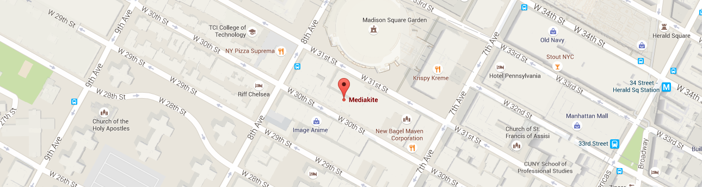

www.mediakite.ru

Mediakite – это находящийся в Нью-Йорке поставщик услуг кино- и видеопроизводства для вещательных и продюсерских компаний, рекламных агентств, музыкальных лейблов и корпораций. Компания Mediakite работает на рынке уже более 15 лет.

Нужен второй офис в NYC? Вы попали по адресу. С целью сокращения накладных расходов корреспонденты, журналисты и продюсеры находящихся вне города вещательных и продюсерских компаний работают из офисов Mediakite, расположенных в самом центре Манхэттена и имеющих легкий доступ ко всем основным районам города.

<iframe src="https://www.google.com/maps/embed?pb=!1m0!3m2!1sen!2sus!4v1464970286804!6m8!1m7!1sLUNruGQfAWAAAAQZCbdhbw!2m2!1d40.74947742828871!2d-73.99405389347004!3f101!4f0!5f0.7820865974627469" width="100%" height="400" frameborder="0" style="border:0" allowfullscreen></iframe>

Mediakite обладает новейшим оборудованием для видеопроизводства в самом центре Манхэттена. Технологические отделы, монтажные комнаты, студии для прямого вещания и узлы коммуникаций.

ПРОИЗВОДСТВО
Mediakite предлагает полный ассортимент кино- и видеопродукции для трансляции новостей, документальных фильмов, рекламных роликов, модных и корпоративных съемок, телепередач, не-скриптовых телешоу, анимации, музыкальных видео, аэрофотосъемки, прямых трансляций, спутникового вещания и прямых включений из студии.

ПРОИЗВОДСТВО НОВОСТЕЙ
Ваша телегруппа по требованию: 24/7, где угодно, когда угодно

Сердце Mediakite – это команда профессионалов с огромным опытом работы в области выпуска новостей (ENG), новостных изданий (EFP) и документальных фильмов.

Масштабируемое производство
От команды ENG на одну камеру до многокамерной передачи коммерческих событий – наша философия масштабируемого производства гарантирует индивидуальный подход к каждому проекту и бюджету.

Новейшие технологии и ультрасовременная аппаратура
Полный спектр конфигураций камер, аудио, освещения и команд производственного обеспечения.

Передвижная телестанция, спутниковая передача, IP-медиа, транслирование событий в прямом эфире, а также аренда вещательного оборудования.

Освещение экстренных сообщений с их немедленной передачей
Команда из одного человека с портативным оборудованием для монтажа и прямого вещания
Прямое вещание (AviWest, Comrex и так далее)
Офисное пространство
Студия на одну камеру с видеопанелью для ПРЯМЫХ включений
Полномочия в ООН и полицейском отделении Нью-Йорка
Производственный транспорт
Страховое свидетельство (COI)/Обязательства/Лицензия
НОВОСТИ И ОСВЕЩЕНИЕ НОВОСТЕЙ (линия экстренной связи в режиме 24/7 +1.917.660.3714)

Список наших клиентов включает AlJAZEERA, BBC, FOX, AP, RAI, TVNZ, Reuters, Canal+, TVI, RT, Radio Television Suisse и многих других.

Для получения более подробной информации посетите наш сайт www.mediakite.com или свяжитесь с нами по электронной почте/телефону.

MEDIAKITE CORP.
247 ЗАПАД 30-я СТРИТ, 
4-й ЭТАЖ, НЬЮ-ЙОРК, 
NY 10001

INFO@MEDIAKITE.COM 
Телефон: +1 212 947 4703

